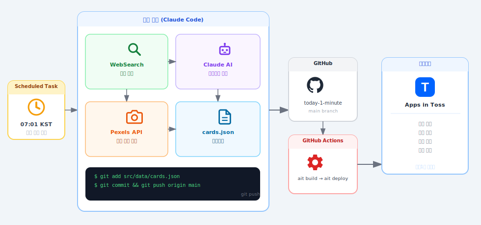

# 하루 1분

> 하루 1분으로 오늘의 한국 뉴스를 파악하는 토스 미니앱

[](https://github.com/lingard1234/today-1-minute/actions/workflows/deploy.yml)

---

## 소개

**하루 1분**은 바쁜 현대인을 위한 카드뉴스 미니앱이에요.
매일 아침 AI가 날씨·경제·IT·사회·문화·스포츠 분야의 실제 뉴스를 골라 짧고 명확하게 정리해줘요.
토스 앱 안에서 1분 안에 오늘 하루를 파악할 수 있어요.

## 주요 기능

- **매일 자동 업데이트** — 매일 07:01 KST, AI가 실제 뉴스를 검색·요약·발행
- **Pexels 실사 사진** — 각 뉴스 주제에 맞는 고화질 사진 자동 매칭
- **날짜별 브라우징** — 과거 날짜 카드뉴스도 날짜 선택기로 확인 가능
- **저장 기능** — 마음에 드는 카드를 마이페이지에 저장
- **다크 모드** — 라이트/다크 테마 전환 지원
- **자동 배포** — `cards.json` push 시 GitHub Actions가 앱인토스에 자동 배포

## 화면 구성

| 홈 | 상세 | 마이페이지 |
|:---:|:---:|:---:|
|  |  |  |

## 자동화 파이프라인



## 기술 스택

| 구분 | 기술 |
|---|---|
| 프레임워크 | React 18, Vite, TypeScript |
| UI | Toss Design System (TDS Mobile) |
| 플랫폼 SDK | @apps-in-toss/web-framework |
| 자동화 | Claude Code Scheduled Tasks |
| 이미지 | Pexels API |
| CI/CD | GitHub Actions + `ait deploy` |

## 로컬 개발

```bash
npm install
npm run dev   # http://localhost:5173
```

환경변수:

```bash
cp .env.example .env
# PEXELS_API_KEY 채우기 (https://www.pexels.com/api/)
```

## 카드 수동 등록

```bash
# 1. AI 초안 생성
npm run card:draft -- --text "뉴스 원문" --category IT

# 2. 초안 검수 후 발행
npm run card:publish -- ./content/drafts/2026-07-13-draft.json
```

## 배포

GitHub Actions가 `src/` 변경 시 자동 배포해요. 수동 배포:

```bash
npm run build && npm run deploy
```

## 유용한 링크

- [앱인토스 콘솔](https://apps-in-toss.toss.im/)
- [앱인토스 개발자센터](https://developers-apps-in-toss.toss.im/)
- [Pexels API](https://www.pexels.com/api/)
